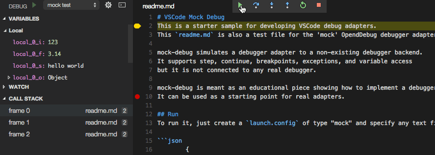

# VS Code Sodium Debugger Adaptor Extension

This is a Sodium Language VS Code debug adapters.

## Using Mock Debug

* Install the **Mock Debug** extension in VS Code.
* Create a new 'program' file `readme.md` and enter several lines of arbitrary text.
* Switch to the debug viewlet and press the gear dropdown.
* Select the debug environment "Mock Debug".
* Press the green 'play' button to start debugging.

You can now 'step through' the `readme.md` file, set and hit breakpoints, and run into exceptions (if the word exception appears in a line).

## Build and Run

* Clone the project [https://github.com/Microsoft/vscode-mock-debug.git](https://github.com/Microsoft/vscode-mock-debug.git)
* Open the project folder in VS Code.
* Press `F5` to build and launch Mock Debug in another VS Code window. In that window:
  * Open a new workspace, create a new 'program' file `readme.md` and enter several lines of arbitrary text.
  * Switch to the debug viewlet and press the gear dropdown.
  * Select the debug environment "Mock Debug".
  * Press `F5` to start debugging.
